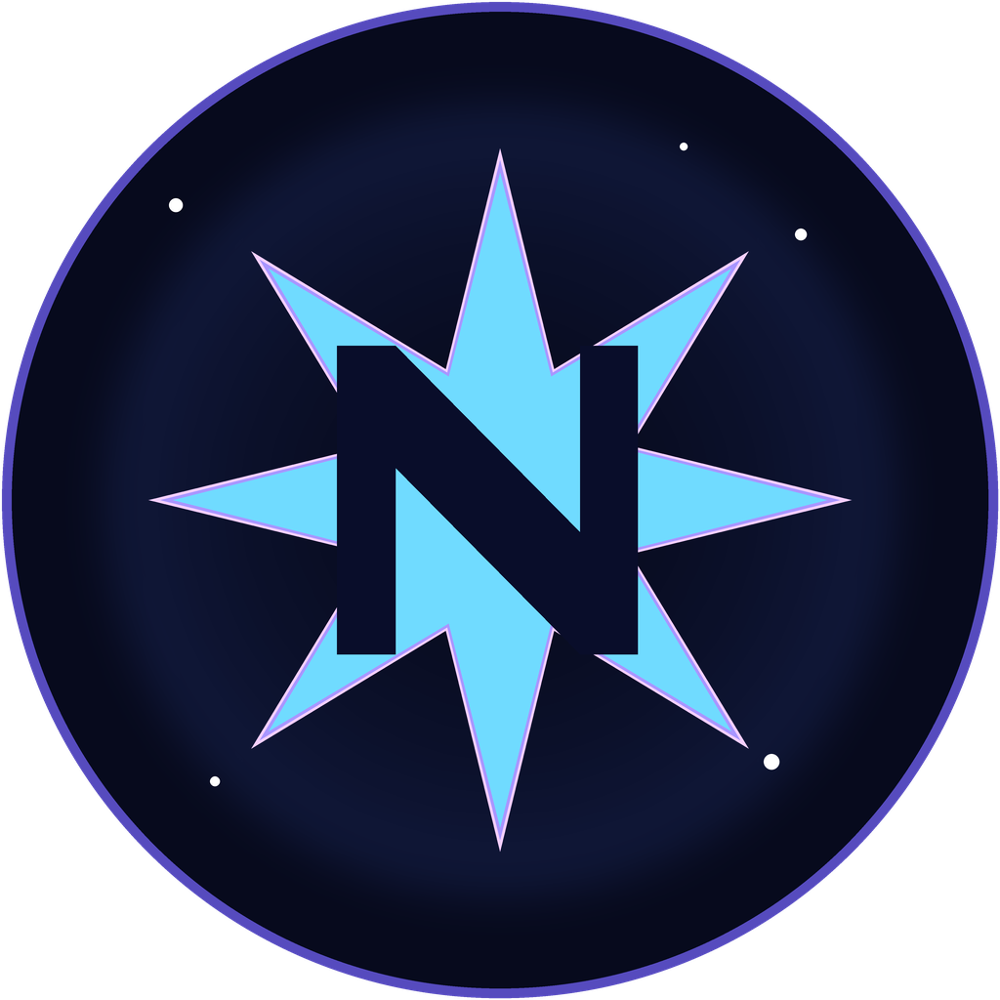

<p align="center"></p>

<h1 align="center">Nebula Launcher</h1>

<p align="center">현실경제 Minecraft 서버를 위한 HeliosLauncher 기반 커스텀 런처</p>

Nebula는 Microsoft 계정 인증을 유지하면서 Java, Minecraft 1.20.1,
Forge 47.4.23, 서버 모드와 업데이트를 자동으로 관리하는 독립 런처입니다.
원본 HeliosLauncher의 라이선스와 저작권 표기는 `LICENSE.txt`에 보존되어
있으며, Nebula의 변경 사항과 출처는 `NOTICE.md`에 정리되어 있습니다.

## Features

* 🔒 Microsoft OAuth account management.
  * Add multiple Microsoft accounts and easily switch between them.
  * Mojang password login is not exposed by Nebula.
* 📂 Efficient asset management.
  * Receive client updates as soon as we release them.
  * Files are validated before launch. Corrupt or incorrect files will be redownloaded.
* ☕ **Automatic Java validation.**
  * If you have an incompatible version of Java installed, we'll install the right one *for you*.
  * You do not need to have Java installed to run the launcher.
* 📰 News feed natively built into the launcher.
* ⚙️ Intuitive settings management, including a Java control panel.
* Supports all of our servers.
  * Switch between server configurations with ease.
  * View the player count of the selected server.
* Automatic updates. That's right, the launcher updates itself.
*  View the status of Mojang's services.
* Fixed client profile: Minecraft 1.20.1 with Forge 47.4.23.
* Server mods are downloaded and checksum-validated automatically from the Nebula distribution server.

This is not an exhaustive list. Download and install the launcher to gauge all it can do!

#### Need Help? [Check the wiki.][wiki]

#### Like the project? Leave a ⭐ star on the repository!

## Downloads

You can download from [Nebula GitHub Releases](https://github.com/aruru10313/Nebula/releases)

#### Latest Release

[](https://github.com/aruru10313/Nebula/releases/latest)

#### Latest Pre-Release
[](https://github.com/aruru10313/Nebula/releases)

**Supported Platforms**

If you download from the [Nebula Releases](https://github.com/aruru10313/Nebula/releases) tab, select the installer for your system.

| Platform | File |
| -------- | ---- |
| Windows x64 | `Nebula-setup-VERSION.exe` |
| macOS x64 | `Nebula-Launcher-setup-VERSION-x64.dmg` |
| macOS arm64 | `Nebula-Launcher-setup-VERSION-arm64.dmg` |
| Linux x64 | `Nebula-setup-VERSION.AppImage` |
| Linux x64 (Debian/Ubuntu) | `Nebula-setup-VERSION.deb` |

macOS builds use the hardened runtime configuration, but still must be signed
and notarized with an Apple Developer certificate before broad distribution.
Linux builds target x64; on systems without FUSE 2, use
`--appimage-extract-and-run`, install the distribution's FUSE compatibility
package, or use the Debian package.

## Console

To open the console, use the following keybind.

```console
ctrl + shift + i
```

Ensure that you have the console tab selected. Do not paste anything into the console unless you are 100% sure of what it will do. Pasting the wrong thing can expose sensitive information.

#### Export Output to a File

If you want to export the console output, simply right click anywhere on the console and click **Save as..**


## Development

This section details the setup of a basic developmentment environment.

### Getting Started

**System Requirements**

* [Node.js][nodejs] v22

---

**Clone and Install Dependencies**

```console
> git clone https://github.com/aruru10313/Nebula.git
> cd Nebula
> npm install
```

---

**Launch Application**

```console
> npm start
```

---

**Build Installers**

To build for your current platform.

```console
> npm run dist
```

Build for a specific platform.

| Platform    | Command              |
| ----------- | -------------------- |
| Windows x64 | `npm run dist:win`   |
| macOS       | `npm run dist:mac`   |
| Linux x64   | `npm run dist:linux` |

Builds for macOS may not work on Windows/Linux and vice-versa.

### Hosting server mods

The launcher does not need access to the Minecraft server filesystem. Run
`npm run generate:distribution` from the Nebula project with
`NEBULA_ASSET_BASE_URL` and `NEBULA_SERVER_ADDRESS` set, then upload the
generated `distribution/` directory to Oracle Cloud Object Storage or an
Oracle VPS running Nginx. Replace the example distribution URL in
`app/assets/js/distromanager.js` before building the installer.

---

### Visual Studio Code

All development of the launcher should be done using [Visual Studio Code][vscode].

Paste the following into `.vscode/launch.json`

```JSON
{
  "version": "0.2.0",
  "configurations": [
    {
      "name": "Debug Main Process",
      "type": "node",
      "request": "launch",
      "cwd": "${workspaceFolder}",
      "program": "${workspaceFolder}/node_modules/electron/cli.js",
      "args" : ["."],
      "outputCapture": "std"
    },
    {
      "name": "Debug Renderer Process",
      "type": "chrome",
      "request": "launch",
      "runtimeExecutable": "${workspaceFolder}/node_modules/.bin/electron",
      "windows": {
        "runtimeExecutable": "${workspaceFolder}/node_modules/.bin/electron.cmd"
      },
      "runtimeArgs": [
        "${workspaceFolder}/.",
        "--remote-debugging-port=9222"
      ],
      "webRoot": "${workspaceFolder}"
    }
  ]
}
```

This adds two debug configurations.

#### Debug Main Process

This allows you to debug Electron's [main process][mainprocess]. You can debug scripts in the [renderer process][rendererprocess] by opening the DevTools Window.

#### Debug Renderer Process

This allows you to debug Electron's [renderer process][rendererprocess]. This requires you to install the [Debugger for Chrome][chromedebugger] extension.

Note that you **cannot** open the DevTools window while using this debug configuration. Chromium only allows one debugger, opening another will crash the program.

---

### Attribution and license

Nebula is a custom launcher based on HeliosLauncher by Daniel D. Scalzi.
The upstream MIT license and copyright notice are preserved in `LICENSE.txt`;
see `NOTICE.md` for the Nebula-specific modifications and third-party usage
notes. For Microsoft authentication implementation details, see the upstream
HeliosLauncher documentation.

---

## Resources

* [Wiki][wiki]
* [Nebula distribution tooling][nebula]
* [HeliosLauncher upstream source][helios]

The best way to contact the developers is on Discord.

[][discord]

---

### See you ingame.


[nodejs]: https://nodejs.org/en/ 'Node.js'
[vscode]: https://code.visualstudio.com/ 'Visual Studio Code'
[mainprocess]: https://electronjs.org/docs/tutorial/application-architecture#main-and-renderer-processes 'Main Process'
[rendererprocess]: https://electronjs.org/docs/tutorial/application-architecture#main-and-renderer-processes 'Renderer Process'
[chromedebugger]: https://marketplace.visualstudio.com/items?itemName=msjsdiag.debugger-for-chrome 'Debugger for Chrome'
[discord]: https://discord.gg/zNWUXdt 'Discord'
[wiki]: https://github.com/aruru10313/Nebula/wiki 'Nebula wiki'
[nebula]: https://github.com/aruru10313/Nebula 'Nebula'
[helios]: https://github.com/dscalzi/HeliosLauncher 'HeliosLauncher upstream source'

## GitHub Releases

Windows builds are published by the existing GitHub Actions workflow when a version tag is pushed.
